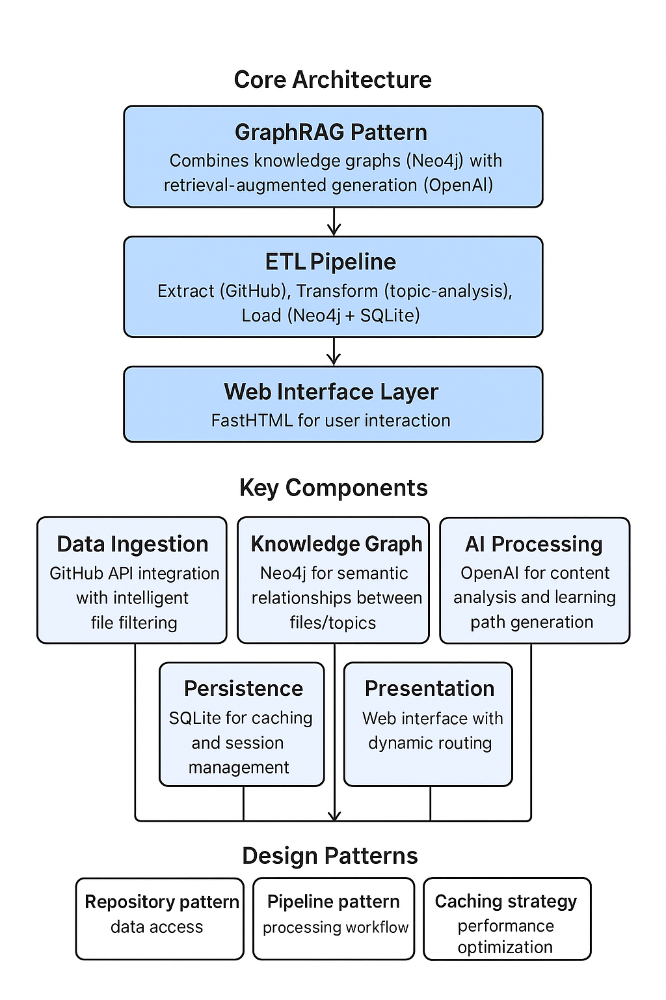
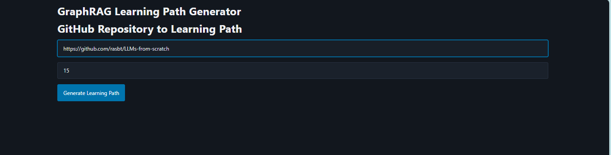
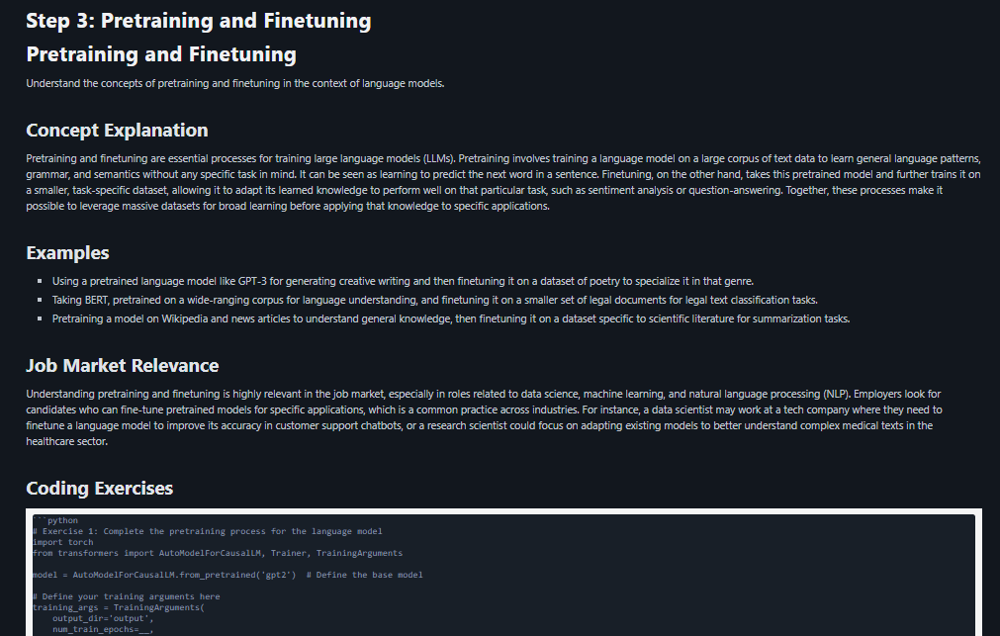

# Project Spec

## System Overview

## Business Problem

For coding jobs continuos learning is one of the most important skills that you need to have. Being able to learn new technologies and frameworks is a must.

This project is a tool that helps you learn new technologies and frameworks by providing you with a learning path based on the code you are working on.

The amount of new frameworks and technologies created is growing exponentially. This makes it difficult to keep up with the latest trends and technologies. Courses and tutorials are not enough to keep up. Sometimes you need to pick-up a skills for an interview or a project. Being able to customize your learning path could speed learner process. In addition, dedicated environment to support students can be a tremendous help for course creators, as they can quickly iterate based on learning content and see if makes sense to move in the direction of the course.

This project aim to fill the gap between technologies and learning content, in which the student can quickly decide their learning path based on the code they are working on. 

## User Interface

1. Select a repository from GitHub
2. Select the number of files to process
3. Click on "GenerateLearning Path"
4. If we already have a learning path for this repository, we can choose to use the existing learning path or regenerate it.
5. Wait for the learning path to be created

## Example Queries

Select a repository from GitHub

Go to the learning steps that will provide:
1. Concept explanation
2. Examples
3. Job Market Relevance
4. Coding Exercises
5. Solutions

## Purpose of the project

This project aim to provide a learning path for a given repository, helping students and course creators a quick tool to iterate on the learning content.

## Dataset

The dataset is a dynamic GitHub url, allowing the user create their learning path using any repository. The choose was made as GitHub contains the most popular repositories for almost all python frameworks and technologies, with a wide range of knwoledge from beginner to advanced. In every data domain. 

## Technology Choices

The project is built with the following technologies:

- Neo4j: This is a graph database that is used to store the learning path. Educational content is built based on the relationships between the content of the repository, as most of them doesn't have a natural structure, being able to group content based on their semantic relationships is not only appropiate but needed to guarantee a good learning experience.

- FastHTML: A user interface library that helps to build UI in a python environment.

- SQLite: This is a lightweight database that is used to store the learning path. It is used to store the learning path and the learning steps to make fast retrieval and avoid regenerating the content. 

## Steps followed and challenges faced

1. We identify a business problem to close the gap between technologies and learning content.
2. We started by iterating on the choose between the storage and retrieval system, which was difficult as the intention was to build a learning content that is able to understand how the different parts of the code are related to each other.
3. The dynamic nature of the project was a challenge as the code needs several steps to build a learning content, from storing the data in the graph database, understand the relationships between the content and build the learning path and the learning steps through openai api, the process was slow, creating a poor user experience, we develop a SQlite database to store the learning path and the learning steps to make fast retrieval and avoid regenerating the content.
4. The retrieval system has two components, the first time you input a repository it will create the Graph Database, this process is slow and requires a lot of resources, we develop a SQlite database to store the learning path and the learning steps to make fast retrieval and avoid regenerating the content.

## Next steps

- Build a dynamic UI allowing the user customize the experience. Input Linkedin profile and generate the best intersection between your query and skills. Input Job description and generate learning content that fills the gap in your skills to match the job requirements.
- Add a system to allow the user to input a job description and generate a learning path that fills the gap in your skills to match the job requirements.
- Add a system to allow the user to input a Linkedin profile and generate a learning path that is the best intersection between your query and skills.
- Add a system to allow the user to input a project description and generate a learning path that is the best intersection between your query and skills.
- Add a system to allow the user to input a repository and generate a learning path that is the best intersection between your query and skills.

# RAG Code:

The ``neo4j_data.py`` file is the main file that is used to store the data in the graph database. We create semantic relaitonship based on content and the code from the repository to match the learning path and the learning steps.